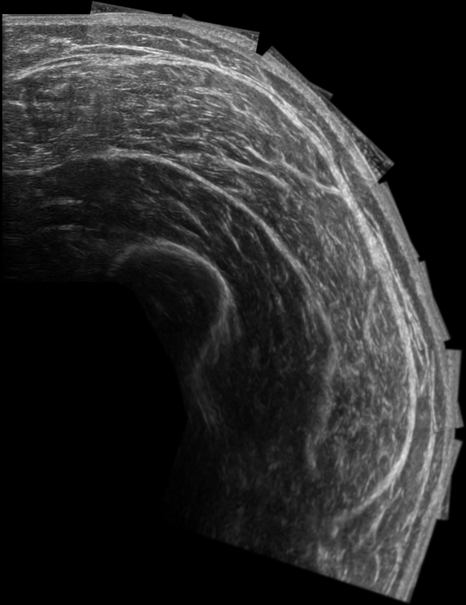

# Muscle Measure

## Requirements

* Docker. Please, note that `docker-compose` is needed too and is included in
the Docker Desktop installation. Docker Desktop is available for
[Mac](https://docs.docker.com/desktop/install/mac-install/),
[Windows](https://docs.docker.com/desktop/install/windows-install/) and
[Linux](https://docs.docker.com/desktop/install/linux-install/).

Note that you do not necessarily need to install Docker Desktop. You can also
install [Docker Engine](https://docs.docker.com/engine/install/) and
[docker-compose](https://docs.docker.com/compose/install/). In that case,
please use `docker-compose` instead of `docker compose` in all commands below.

* DVC, to manage the binary data like models and example images we use dvc to get data correctily, please follow instructions to install dvc [here](https://dvc.org/). 

## Getting started

The setup takes place in 3 steps.
1. Download the [zip data folder](https://drive.google.com/file/d/1h6Bq0jytUBLhi7TzByROGB1zNm7-4ZRr/view?usp=sharing) and decompress on the root of repository.
2. Use dvc command to get all necessary data.
```bash
$ dvc pull
```

3. Start the containers and run the appropriate commands from below depending on
the way you want to run Joinup.

#